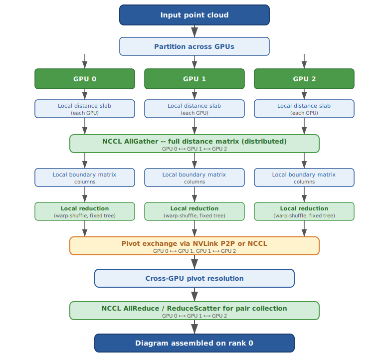

# Multi-GPU

## NCCL collectives

Pynerve uses NCCL for inter-GPU collectives within a node:

- `ncclAllGather` for gathering distributed distance matrix chunks
- `ncclReduce` for aggregating column reduction results
- `ncclBroadcast` for pivot exchange
- `ncclAllReduce` for distributed diagram merging
- `ncclReduceScatter` for scatter-reduce of partial reduction results

CUDA graphs encapsulate NCCL operations for replay, reducing launch latency.

### NCCL communicator setup

```cpp
// src/distributed/nccl_mpi_bridge.cpp
ncclUniqueId id;
if (mpi_rank == 0) ncclGetUniqueId(&id);
MPI_Bcast(&id, sizeof(id), MPI_BYTE, 0, MPI_COMM_WORLD);
ncclCommInitRank(&comm, mpi_size, id, mpi_rank);
```

## NVLink P2P peer access

When GPUs are connected via NVLink (detected via `nvmlDeviceGetNvLinkCapability`):

- `cudaMemcpyPeer` for direct GPU-to-GPU column exchange
- Automatic fallback to `cudaMemcpyDeviceToDevice` (through host) when P2P is unavailable
- Peer mapping established lazily on first cross-GPU access

### P2P exchange protocol

```
Rank A needs column from Rank B:
1. Check NVLink topology: nvlink_matrix[A][B]?
2. If P2P: cudaMemcpyPeer(gpu_buf_A, device_A, gpu_buf_B, device_B, size)
3. If no P2P: stage through pinned host memory
   a. cudaMemcpy(host_buf_B, gpu_buf_B, size, D2H)
   b. MPI_Send(host_buf_B, ...) or cudaMemcpyPeer through host
4. Signal completion via NCCL or MPI
```

## Device topology detection

`NvLinkTopology::detect()` probes the P2P connectivity matrix:

```cpp
struct NvLinkTopology {
    int num_gpus;
    std::vector<std::vector<bool>> p2p_matrix;
    std::vector<int> nvlink_link_counts;
    int max_bandwidth_gbps;  // per-link
};
```

Detected topology drives work distribution: GPUs in the same NVLink domain share columns with minimal latency. Cross-domain GPUs receive independent work partitions to avoid P2P penalties.

## Multi-GPU reduction flow




<- [Back to GPU Acceleration index](index.md)
