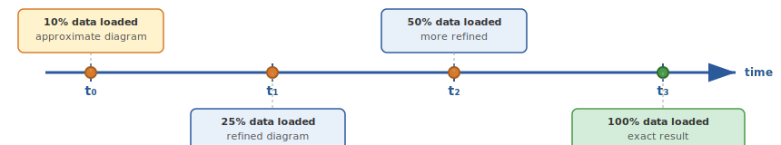

# Streaming processor (C++ API)

The streaming processor provides an alternative API built on chunk processing:

```cpp
// src/include/nerve/persistence/adaptive_acceleration/streaming/
// - streaming_processor.hpp
// - approximate_processor.hpp

struct StreamingConfig {
    size_t chunk_size = 1000;
    size_t max_buffered_chunks = 3;
    bool use_gpu = true;
    int num_workers = 4;
};

class StreamingProcessor {
    processStreaming(DataStream& stream);
    processStreamingProgressive(DataStream& stream);
};
```

### Progressive refinement

`processStreamingProgressive` returns an initial approximate result instantly and refines it as more data arrives -- useful for interactive visualization of live data streams.



Each refinement step updates existing pairs rather than recomputing from scratch:

```cpp
// Approximate diagram consolidation
struct ApproximateDiagram {
    std::vector<Pair> pairs;
    std::vector<Pair> pending;  // pairs from newer chunks not yet merged
    size_t chunks_processed;
    double confidence;  // 0.0 to 1.0, increases with more data

    void merge_chunk(const std::vector<Pair>& chunk_pairs);
    bool is_stable(double threshold) const;  // true if diagram stabilized
};
```

[Back to index](index.md)
