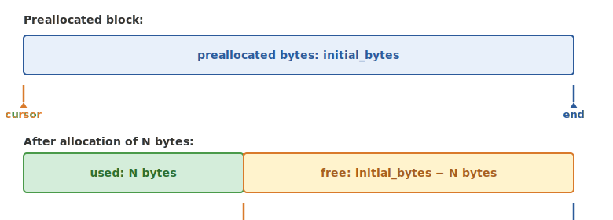

## RawArrayPool

```cpp
namespace nerve::memory {

class RawArrayPool {
public:
    RawArrayPool(Size initial_bytes = 64 * 1024 * 1024,
                 bool use_hugepages = false);
    ~RawArrayPool();

    void* allocate(Size bytes);
    void deallocate(void* ptr, Size bytes);

    Size totalAllocated() const;
    Size peakUtilization() const;
    void reset();
};

}
```

Bump allocator for contiguous byte arrays. Maintains a cursor that advances
atomically (`compare_exchange_weak`) on each allocation. Deallocation is a
no-op (memory is reclaimed on `reset()` or destruction).


### Internal structure



Allocation advances the cursor by the requested size. No per-allocation
metadata is stored -- zero overhead per allocation.


### Hugepage support

When `use_hugepages = true`, the pool allocates backing memory from
`GlobalPagePool` (a couple of megabytes hugepages). This reduces TLB pressure for large
persistent allocations (distance matrices, boundary matrices).

```cpp
RawArrayPool pool(256 * 1024 * 1024, /*use_hugepages=*/true);
void* buf = pool.allocate(4096);
```

**Hugepage benefits:**
- a couple of megabyte pages vs a few kilobytes: 512x fewer TLB entries needed
- ~10-20% performance improvement for large working sets
- Reduced page fault overhead during warmup


### Deallocation semantics

No per-allocation metadata is stored; you must pass the original size back.
The pool does not coalesce; use separate pools for different allocation
sizes, or use `SizeClassAllocator`.

```cpp
void* buf1 = pool.allocate(1024);
void* buf2 = pool.allocate(2048);

// pool.deallocate(buf1, 1024);  // no-op!
// pool.deallocate(buf2, 2048);  // no-op!

// Memory is reclaimed only on reset:
pool.reset();
```


## SizeClassAllocator

```cpp
class SizeClassAllocator {
public:
    SizeClassAllocator();

    void* allocate(Size bytes);
    void deallocate(void* ptr, Size bytes);

    Size totalAllocated() const;
    Size getSizeClass(Size bytes) const;
};
```

Manages 16 size classes, each backed by a `RawArrayPool`:

16 size classes are managed: **Tiny16** covers up to 16 B, **Tiny32** up to 32 B, **Tiny64** up to 64 B, **Small128** up to 128 B, **Small256** up to 256 B, **Small512** up to 512 B, **Medium1K** up to 1 KB, **Medium2K** up to 2 KB, **Medium4K** up to 4 KB, **Large8K** up to 8 KB, **Large16K** up to 16 KB, **Large32K** up to 32 KB, **Huge64K** up to 64 KB, **Huge128K** up to 128 KB, **Huge256K** up to 256 KB, and **Huge512K** up to 512 KB.

Allocations larger than hundreds of kilobytes fall through to `malloc`.


## Global page pool

```cpp
class GlobalPagePool {
public:
    static GlobalPagePool& instance();

    void* allocatePage();
    void deallocatePage(void* page);

    Size pagesAllocated() const;
    Size hugetlbPagesAllocated() const;
    Size pageSize() const;
};
```

Manages a couple of megabyte hugepage allocation from the OS. Uses a lock-free free-list of
returned pages for recycling. Falls back to a few kilobyte pages if hugepages are
exhausted.


## PoolBackedVector

```cpp
template <typename T>
class PoolBackedVector {
public:
    explicit PoolBackedVector(RawArrayPool& pool);

    void reserve(Size capacity);
    void push_back(const T& value);
    void push_back(T&& value);
    template <typename... Args>
    T& emplace_back(Args&&... args);
    void clear();

    T& operator[](Size index);
    const T& operator[](Size index) const;
    T* data();
    const T* data() const;
    Size size() const;
    Size capacity() const;
    bool empty() const;

    T* begin();
    T* end();
    const T* begin() const;
    const T* end() const;
};
```

A `std::vector`-like container that allocates from a `RawArrayPool`. Does not
own its memory; the pool must outlive the vector. Good for algorithms that
pre-allocate a pool and then build many temporary vectors.

```python
import pynerve.memory as mem

pool = mem.RawArrayPool(initial_bytes=64 * 1024 * 1024)
buf = pool.allocate(4096)
pool.deallocate(buf, 4096)
```


### Performance comparison

For `push_back`, both `std::vector` and `PoolBackedVector` are O(1) amortized. For memory on push_back, `std::vector` allocates and frees per resize while `PoolBackedVector` simply bumps a cursor. Destruction of `std::vector` is O(n) deallocation while `PoolBackedVector` is a no-op. Memory overhead for `std::vector` includes per-allocation metadata while `PoolBackedVector` has 0 bytes overhead.

`PoolBackedVector` is ideal for tight loops that create many temporary
vectors, such as boundary matrix reduction.


## FAQ

**Why is deallocation a no-op in RawArrayPool?**
The bump allocator design avoids per-allocation metadata overhead. Memory is reclaimed atomically on `reset()` or destruction. Use `SizeClassAllocator` when you need individual deallocation.

**When should I enable hugepages?**
Use hugepages for large persistent allocations such as distance matrices or boundary matrices. The a couple of megabyte page size reduces TLB pressure by a factor of 512 compared to a few kilobyte pages, yielding ~10-20% performance improvement for large working sets.

**Does PoolBackedVector own its memory?**
No. The backing `RawArrayPool` must outlive the vector. This is a deliberate design choice for algorithms that pre-allocate a pool and build many temporary vectors without per-allocation overhead.


### Cross-references

- `pynerve.memory.memory`: Memory overview
- `pynerve.memory.slab_allocator`: Complement for fixed-size objects
- `pynerve.memory.tracking`: Allocation tracking
