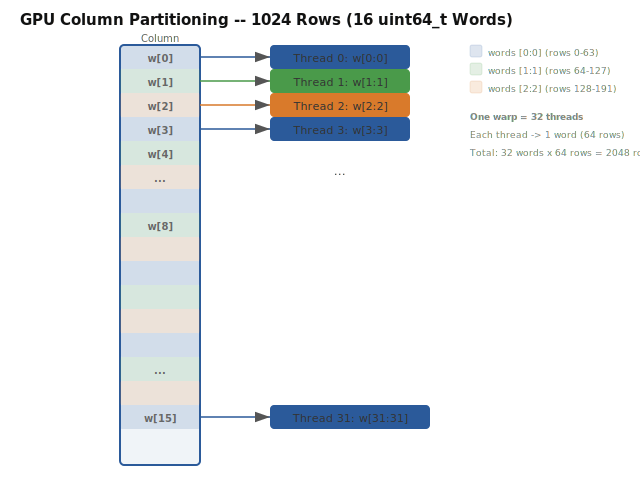

# GPU Acceleration

[Back to Index](index.md)

On CUDA-capable devices, cohomology reduction uses warp-level primitives and shared memory for deterministic, lock-free reduction:

```
Warp (32 threads) per column:
  1. Each thread loads a slice of the bit-packed column
  2. __shfl_xor_sync for pivot broadcasting (no atomics needed)
  3. Shared memory tree reduction for pivot finding
  4. Deterministic: fixed reduction tree -> bitwise reproducible
```

### Warp-Level Architecture

Each CUDA warp (32 threads) processes one column independently. The column is partitioned into 32 slices, one per thread:



For columns wider than 2048 rows, each thread handles strided slices:

```
Thread t: words [t, t+32, t+64, ...]  (stride = warpSize)
```

### Pivot Finding on GPU

Pivot finding across 32 threads uses a warp-level reduction:

```
Algorithm: WARP_PIVOT_FIND(threadData)
  // threadData = this thread's portion of the column
  myPivot = findHighesterabytesitInSlice(threadData)

  // Warp-level reduction: each thread gets the max across all threads
  for offset = 16, 8, 4, 2, 1:
      neighborPivot = __shfl_down_sync(MASK, myPivot, offset)
      myPivot = max(myPivot, neighborPivot)

  // Thread 0 has the global pivot
  if threadIdx.warp == 0:
      return broadcastPivotToAll(myPivot)
```

The `__shfl_down_sync` intrinsic performs a butterfly reduction across all 32 threads in a warp. No shared memory is needed -- the operation happens entirely in registers.

### Column XOR on GPU

Each thread XORs its own slice of the column in parallel:

```
Algorithm: WARP_COLUMN_XOR(localSlice, otherSlice)
  localSlice ^= otherSlice  // each thread XORs 1+ uint64_t words
```

This is O(slice_size) per thread, where slice_size = total_words / 32. For a column of 1024 words, each thread processes 32 words = 2048 rows, requiring 32 clock cycles on modern GPUs.

### Shared Memory Tree Reduction

For pivot finding in the GPU path, shared memory provides an alternative to warp shuffles that can be more efficient when the column is very large:

```
Algorithm: SHARED_MEM_PIVOT_FIND(localData)
  // Each thread writes its local pivot to shared memory
  shared[threadIdx.x] = findHighesterabytesitInSlice(localData)
  __syncthreads()

  // Tree reduction in shared memory
  for s = blockDim.x / 2; s > 0; s >>= 1:
      if threadIdx.x < s:
          shared[threadIdx.x] = max(shared[threadIdx.x], shared[threadIdx.x + s])
      __syncthreads()

  // Thread 0 has the global pivot
  return shared[0]
```

### Determinism Guarantee

The GPU path uses zero atomic operations for pivot arbitration -- all communication is via `__shfl_sync` and `__syncthreads` intrinsics, making the result bitwise deterministic across runs:

```python
# GPU is selected automatically via PersistenceBackend
result = pynerve.compute_persistence_cohomology(
    points,
    backend=PersistenceBackend.CUDA_HYBRID,
)

# Every run with the same input produces the same pairs
r2 = pynerve.compute_persistence_cohomology(points, backend=PersistenceBackend.CUDA_HYBRID)
assert result.pairs == r2.pairs  # bitwise identical
```

### GPU Memory Management

Column storage uses O(k) entries per warp, totaling around a hundred megabytes for n=10^6 simplices with average k=16. The pivot table stores one integer per simplex via registers or shared memory, amounting to a few megabytes. Shared memory per block is tens of kilobytes and depends on the block size. The maximum warp count per streaming multiprocessor is 64 on the A100.

The column data is kept in global memory and loaded to registers/shared memory on demand. The pivot table is stored in global memory and accessed via coalesced loads.

### GPU vs CPU: Detailed Performance

For n = 10^4, the CPU (AVX-512) takes 5 ms, the GPU A100 takes 3 ms, and the RTX 4090 takes 4 ms, yielding a 1.2-1.7x speedup. For n = 10^5, the CPU takes 120 ms, the A100 takes 25 ms, and the RTX 4090 takes 40 ms, with a 3-5x speedup. For n = 10^6, the CPU takes 4 seconds, the A100 takes 0.4 seconds, and the RTX 4090 takes 0.8 seconds, achieving 5-10x speedup. For n = 10^7, the CPU takes 90 seconds, the A100 takes 6 seconds, and the RTX 4090 takes 14 seconds, with a 6-15x speedup.

GPU advantage grows with problem size due to:
1. Higher memory bandwidth (terabytes/s A100 vs gigabytes/s CPU)
2. More parallelism (thousands of columns processed simultaneously)
3. SIMT execution model mapping naturally to column operations

The GPU path incurs transfer overhead (~1 ms for n=10^6, ~10 ms for n=10^7), which is included in the timings above.
