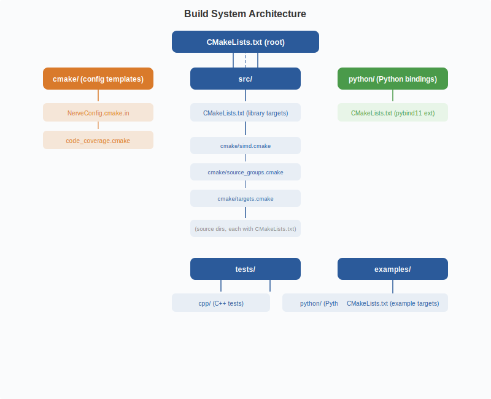

# Build System, Source Map & Workflow

## Build system architecture

### Build flags reference

`BUILD_CUDA` (ON/OFF, default ON) enables CUDA kernel compilation. `BUILD_PYTHON` (ON/OFF, default ON) controls building the Python bindings. `BUILD_TESTS`, `BUILD_BENCHMARKS`, and `BUILD_EXAMPLES` (all ON/OFF, default OFF) control whether test, benchmark, and example targets are built. `ENABLE_MPI` (ON/OFF, default OFF) enables MPI support for distributed computation. `ENABLE_NUMA` (ON/OFF, default OFF) enables NUMA-aware allocation and thread pools. `ENABLE_PYTORCH` (ON/OFF, default ON) enables the PyTorch C++ bridge. `ENABLE_MIMALLOC` (ON/OFF, default ON) uses the mimalloc allocator. `ENABLE_HUGEPAGES` (ON/OFF, default ON) enables hugepage support for memory pool backing. `ENABLE_IO_URING` (ON/OFF, default OFF) enables io_uring-based async I/O. `NERVE_SIMD` (auto/avx512/avx2/scalar, default auto) selects the SIMD dispatch mode. `CMAKE_BUILD_TYPE` (Release/Debug/RelWithDebInfo, default Release) sets the build configuration.

## Source directory map

The `src/persistence/` directory contains the PH4, PH5, and PH6 engines, matrix reduction, and accelerated variants, depending on `src/algebra/`, `src/algorithms/`, and `src/core/`. `src/cuda/kernels/` holds the CUDA kernel library for distance, reduction, mapper, and persistence image operations, depending on the CUDA runtime. `src/distributed/` contains the MPI communicator, NCCL bridge, NVSHMEM bridge, and work stealing logic, depending on `src/persistence/`, MPI, and NCCL. `src/streaming/` provides lock-free streaming, windowed PH, and GPU streaming, depending on `src/persistence/` and `src/core/`. `src/algorithms/` implements distance algorithms, KNN, HNSW, and vectorization, depending on `src/core/`. `src/algebra/` defines simplicial complexes, chain complexes, boundary matrices, and finite fields, depending on `src/core/`. `src/core/` is the foundation layer with thread pools, memory pools, error handling, and buffer types, with no internal dependencies. `src/gpu/` manages the GPU memory pool, streams, and error handling, depending on the CUDA runtime. `src/spectral/` contains Laplacians, Dirac operators, and the eigensolver, depending on `src/core/`. `src/sheaf/` provides Sheaf Laplacian construction and solving, depending on `src/core/` and `src/spectral/`. `src/graphs/` implements graph algorithms, GNNs, attention, and message passing, depending on `src/core/` and `src/gpu/`. `src/torch/` is the PyTorch C++ bridge, depending on the PyTorch libtorch library. `src/io/` provides NPY and HDF5 readers plus async I/O with io_uring, with no internal dependencies. `src/serialization/` provides FlatBuffers and Arrow serialization, with no internal dependencies.

## Workflow data flow

The workflow forks into two paths at backend selection. **CPU path (CPU_ADAPTIVE_ACCELERATION, default)**: `DistanceMatrixComputer::compute()` (SIMD dispatch, OpenMP parallel) -> `VRFiltration::build()` (edge extraction, simplex gen, sorting) -> `PH5PH6Engine::computePersistenceCohomology()` (cohomology reduction with clearing) -> pair extraction from reduced matrix -> PersistenceResult -> Python dict. **GPU path (CUDA_HYBRID)**: `cudaMemcpy H2D` (points -> GPU) -> `matrix_distance_api_cuda.cu` (Tensor Core) -> edge extraction -> apparent pairs -> `cuda_matrix_reduction_compute.cu` (warp-shuffle reduction) -> `cuda_matrix_reduction_diagram.cu` -> `cudaMemcpy D2H` (results -> host) -> PersistenceResult -> Python dict. Both paths produce identical results.

[Back to Architecture Index](index.md)
