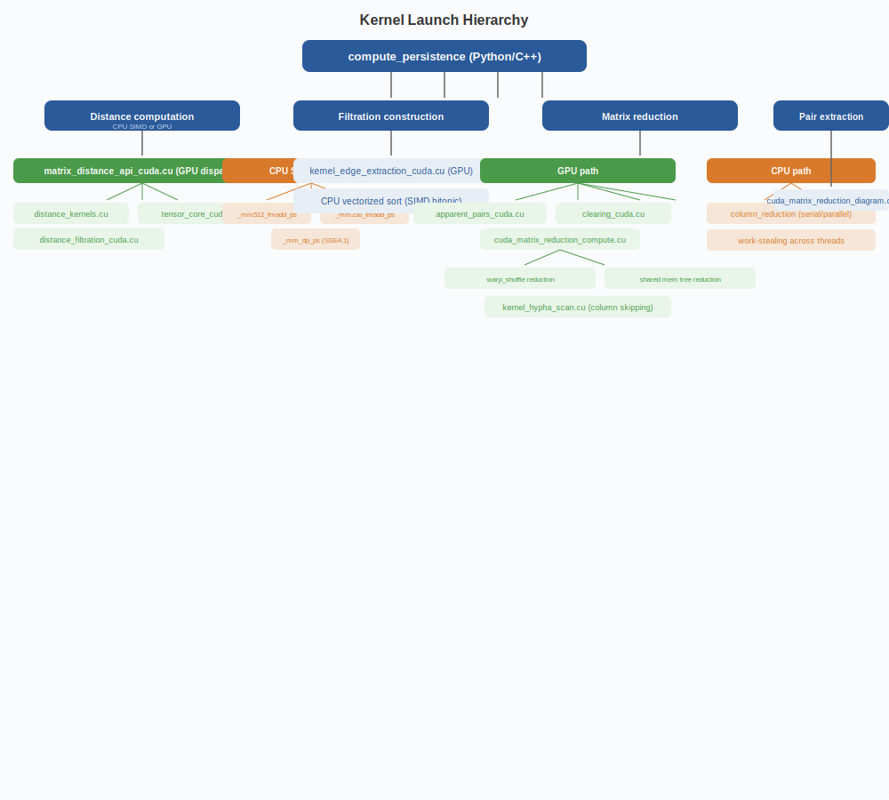

# Kernel Structure & Launch Hierarchy

## Kernel Structure

Pynerve's CUDA kernels (approximately 220+) are organized by domain. The largest group is Persistence and Reduction with roughly 66 kernels covering column reduction, cohomology, clearing, apparent pairs, pivot resolution, and pair extraction. Distance computation has about 20 kernels for pairwise, tiled, tensor-core, FP16, streaming, and batched operations. The Spectral domain uses roughly 8 kernels for Laplacian construction and eigenvalue reduction. Graphs and GNNs have approximately 9 kernels for K-means initialization, assignment, and updates, density and eccentricity filters, nerve edge construction, cover building, and Reeb graph computation. Sheaf computation contributes 2 kernels for Sheaf Laplacian computation. The Metrics domain (Wasserstein and Bottleneck distance) has roughly 12 kernels for cost matrix computation, Sinkhorn iterations, auction algorithm, and greedy matching. Filtration uses about 5 kernels for edge extraction, simplex filtration, and apparent pair detection. Streaming persistence has approximately 7 kernels for windowed persistence homology and chunk persistence. There are 2 probabilistic kernels for randomized reduction, 5 auto-diff kernels for the differentiable PH backward pass, and roughly 7 mapping and clustering kernels for Mapper GPU, cluster-16-block, TMA multicast, and distributed L2. Neural net operations have about 5 ML kernels on GPU. Adaptive acceleration provides approximately 7 kernels for enhanced distance and reduction operations with performance monitoring. The remaining roughly 28 kernels cover autodiff, regularization, optimization, column norm, compression, and miscellaneous operations.

### Key kernel files by source directory

**src/persistence/cuda/** (34 files):
- `cuda_matrix_reduction_*.cu` -- core reduction kernels (4 files)
- `kernel_clearing_cuda.cu` -- clearing optimization
- `kernel_apparent_pairs_cuda.cu` -- apparent pair detection
- `kernel_warp_specialized_cuda.cu` -- persistent warp partitioning (Hopper+)
- `kernel_tma_cuda.cu` -- TMA-based data movement (Hopper+)
- `kernel_tile_cuda.cu` -- tiled reduction with shared memory
- `kernel_hypha_scan.cu` -- column-skipping optimization
- `tensor_core_cuda.cu` -- Tensor Core distance computation
- `multi_gpu_cuda.cu` -- multi-GPU coordination
- `distance_filtration_cuda.cu` -- combined distance + filtration
- `cohomology_clearing_cuda.cu` -- cohomology with natural clearing
- `matrix_distance_api_cuda.cu` -- distance API dispatch

**src/cuda/kernels/** (12 files):
- `gpu_persistence_reduction.cu` -- top-level reduction dispatcher
- `reduction_kernels.cu` -- standard reduction kernels
- `specseq_reduction.cu` -- spectral sequence reduction
- `distance_kernels.cu` / `distance_kernels_ext.cu` -- pairwise distance
- `distance_fasted.cu` / `distance_tedjoin.cu` -- optimized distance variants
- `bottleneck_distance.cu` / `wasserstein_distance.cu` -- metric computation
- `persistence_image.cu` -- persistence image rendering
- `mapper_gpu.cu` -- GPU mapper algorithm
- `gpu_persistence_launcher.cu` -- persistence launch configuration

**src/streaming/gpu/** (2 files):
- `streaming_persistence_cuda.cu` -- chunk-based streaming
- `windowed_ph_cuda.cu` -- sliding window persistence

## Kernel launch hierarchy

[Back to Architecture Index](index.md)
