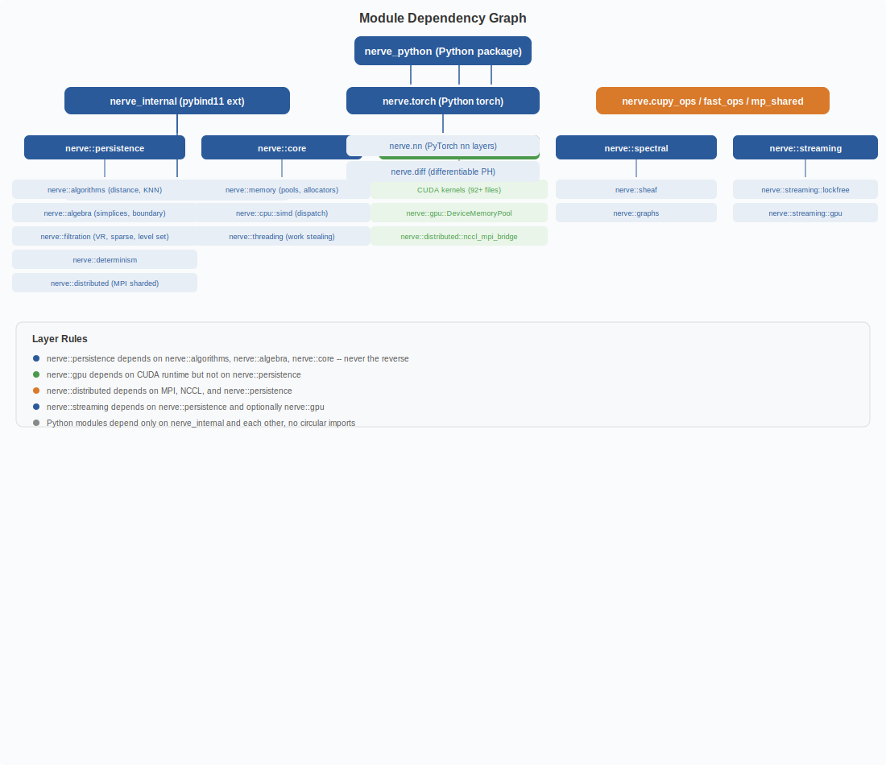

# Stack Diagram & Module Dependencies

## Stack Diagram

The software stack has six layers from top to bottom. **Layer 1  --  nerve (public API)**: Python package with `compute_persistence`, `persistence_image`, type hierarchy, error types, async/streaming, and PyTorch integration. **Layer 2  --  nerve_internal**: Thin pybind11 module exposing C++ entry points (`PersistenceOptions`, `PH5PH6Engine`). **Layer 3  --  nerve_core**: Core C++ library with VR/Witness/Alpha persistence, distance, matrix reduction, cohomology, memory pools, thread pools, and determinism. **Layer 4  --  CUDA**: 92+ GPU kernels for distance, reduction, cohomology, clearing, apparent pairs, spectral sequences, mapper, and bottleneck computation, using cub, cuBLAS, cuSOLVER, and cuSPARSE. **Layer 5  --  MPI**: Distributed persistence via `MPI_Allgatherv` with Mayer-Vietoris spectral sequence, plus NCCL and NVSHMEM bridges. **Layer 6  --  SIMD**: Runtime CPUID-detected dispatch to AVX-512, AVX2, or SSE4.1 paths.

### Layer Responsibilities

The Python `pynerve` package provides the public API with functions like `compute_persistence` and `persistence_image`, along with the type hierarchy, error types, async/streaming support, and PyTorch integration. Below it, `pynerve_internal` is a thin pybind11 module that exposes `nerve_core` C++ functions to Python, including `PersistenceOptions`, `PH5PH6Engine`, and entry points. The `nerve_core` C++ library contains core algorithms such as VR, Witness, and Alpha persistence, distance computation, matrix reduction, cohomology, memory pools, thread pools, and determinism contracts. The CUDA layer provides GPU kernels for distance, reduction, cohomology, clearing, apparent pairs, spectral sequences, mapper, and Wasserstein or bottleneck computation. MPI handles distributed persistence via `MPI_Allgatherv` with the Mayer-Vietoris spectral sequence, plus NCCL and NVSHMEM bridges for GPU-to-GPU communication. The SIMD layer performs runtime CPUID-detected dispatch to AVX-512, AVX2, or SSE4.1 paths for distance, filtration, reduction, spectral, and sheaf operations.

### Build Configuration

The `BUILD_CUDA` flag (default ON) enables GPU kernels and CUDA memory pools. `ENABLE_MPI` (default OFF) enables distributed persistence. `NERVE_SIMD` (default `auto`) selects the SIMD mode from `auto`, `avx2`, `avx512`, or `scalar`. This is a C++ build flag for the `nerve_core` library. `ENABLE_NUMA` (default OFF) enables NUMA-aware memory and thread pools. `ENABLE_PYTORCH` (default ON) enables PyTorch integration including autograd, neural network layers, and the Mapper algorithm.

## Module dependency graph

### Layer rules

- `nerve::persistence` depends on `nerve::algorithms`, `nerve::algebra`, `nerve::core` -- never the reverse
- `nerve::gpu` depends on CUDA runtime but not on `nerve::persistence`
- `nerve::distributed` depends on MPI, NCCL, and `nerve::persistence`
- `nerve::streaming` depends on `nerve::persistence` and optionally `nerve::gpu`
- Python modules depend only on `nerve_internal` and each other, with no circular imports

[Back to Architecture Index](index.md)
