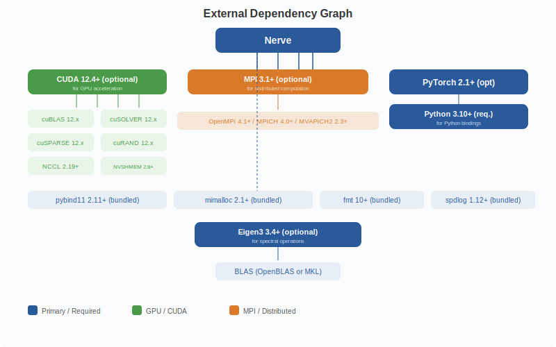

# Version Compatibility & Dependencies

## Version compatibility

Pynerve version 0.1.x requires CUDA 12.4 or later, Python 3.10 through 3.12, PyTorch 2.1 through 2.4, OpenMPI 4.1 or later, and CMake 3.20 or later. The planned 0.2.x release will require CUDA 12.6 or later, Python 3.11 through 3.13, PyTorch 2.3 through 2.5, OpenMPI 5.0 or later, and CMake 3.28 or later.

## Dependency graph (external)

[Back to Architecture Index](index.md)
