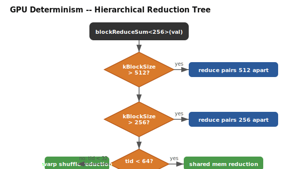

# GPU Determinism

### Default: Fixed-Tree Reductions

GPU reductions use warp shuffle + shared memory reduction trees. No atomics are used in reduction kernels.

```cpp
// Device-side reduction -- deterministic across runs
__device__ double val = /* column operation result */;
double block_sum = nerve::determinism::blockReduceSum<256>(val);
```

The tree structure:



### GPU determinism protocol

```
1. Compile with --fmad=false, --prec-div=true, --prec-sqrt=true, --ftz=false
2. Define NERVE_GPU_DETERMINISM=1 for RFA (cross-architecture reproducibility)
3. Without RFA: results are deterministic for a fixed GPU architecture
4. With RFA: results are bit-identical across GPU architectures
5. No atomic operations in reduction kernels
6. Fixed reduction tree order: the XOR pattern in warpReduceSum is constant
7. Shared memory tree reduction follows a fixed hierarchical pattern
8. No floating-point reassociation within kernel code
```

### RFA (Reduction Fusion Algorithm) -- Opt-In

For GPU-to-GPU reproducibility across different GPU architectures, enable RFA:

```cmake
add_compile_definitions(NERVE_GPU_DETERMINISM=1)
```

This replaces hardware-specific reduction order with a fused reduction pass that yields the same result on any CUDA-capable device.

RFA protocol:
```
1. Each column is assigned a global index
2. Accumulated values are sorted by global index before reduction
3. Reduction follows a deterministic binary tree on sorted values
4. Partial sums are broadcast across ranks with sorted merge
5. Result: bit-identical across any GPU count or topology
```

### HyphaReducer GPU Persistence Reduction

The HyphaReducer (`src/persistence/reduction/reduction_hypha_ops.cpp`) implements GPU-accelerated persistence reduction using warp-level packed-column operations. Unlike the fixed-tree GPU operations described above, the HyphaReducer uses **atomicCAS** for pivot claiming -- multiple warps race to claim pivots via CAS, and the lowest column index always wins.

This introduces **non-determinism** at the pair-value level (which birth simplex pairs with which death simplex) and a **~0.22% residual count-level error** vs the sequential ground truth. The root cause is that `d_reduced[i]` is a snapshot written once at claim time while other warps are still racing, making survivors' forms non-deterministic. A post-pass cascade corrects most but not all of this (the lockfree CPU reducer achieves 0.0000% count accuracy because it works on shared mutable final state, not snapshots).

For applications requiring reproducible persistence reduction on GPU, use the deterministic sequential reducer (`Reducer::reduceTwist` / `reduceSequentialFast`) at the cost of lower throughput.


[Back to Correctness Index](index.md)
