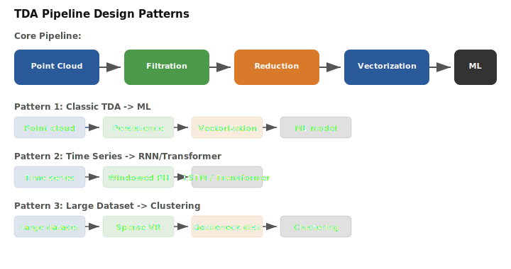

# Decision Guide

This guide maps common TDA use cases to the best Pynerve configuration. Each decision includes the applicable scale, rationale, and trade-offs.

## Complex Type Selection

Six complex types are available. **Vietoris-Rips** works for n < 10K with dim <= 3, building the full simplex flag complex with exact results for small-to-moderate point clouds. **Sparse VR** is best for n > 50K with dim <= 3, producing a 10-100x smaller complex via epsilon-net sampling while retaining homotopy type within approximation bounds. **Witness** handles n > 100K with dim <= 5, building an approximate complex from landmark points with a low memory footprint that scales to millions of points. **Alpha** works for dim <= 3 with geometric data, using Delaunay triangulation for exact persistent homology with a smaller complex than VR, but only in dimensions 2 and 3. **Cohomology** suits sparse filtrations with much faster reduction than homology for complexes with few simplices per dimension, using backward-propagation to avoid unnecessary column operations. **Standard reduction** is better for dense filtrations where cohomology overhead dominates, using direct matrix reduction with clear/compress optimization.

For small datasets (n < 1,000, dim <= 3), VR exact provides millisecond runtime and exact accuracy with O(n^2) memory. For moderate datasets (1,000 to 10,000 points, dim <= 3), VR exact still works at second-scale runtime with exact accuracy. Between 10,000 and 50,000 points with dim <= 3, Sparse VR with 1% landmarks reduces memory to O(k^2) with 1-10 second runtime and epsilon-interleaved accuracy. For 50,000 to 1,000,000 points with dim <= 3, Sparse VR with 0.1% landmarks gives O(k^2) memory and 10-60 second runtime. Beyond 1,000,000 points with dim <= 3, Witness with 100 landmarks provides O(k*n) memory and approximate accuracy at minute-scale runtime. For geometric data with n < 10,000 and dim 2-3, Alpha offers exact accuracy with O(n^2) memory and millisecond runtime. For high-dimensional data (d > 10) at any n, use Sparse or Witness with HNSW.


## Hardware Selection

Four hardware configurations are available. **GPU** is recommended for n > 10K when an NVIDIA GPU is available, offering 2-10x faster cohomology reduction through parallel column operations, batched distance computation, and concurrent kernel execution. **CPU** works best for n < 10K or when no GPU is available, avoiding PCIe transfer overhead for small data while SIMD dispatch provides competitive performance at low n. **Multi-GPU** suits n > 100K on multi-GPU nodes, using NCCL-based communication and NVSHMEM for unified access with point cloud partitioning across GPUs. **GPU + MPI** targets multiple nodes with GPUs, using NCCL within nodes and MPI between nodes via overlapping cover decomposition.

Performance varies by scale. At n = 1,000, a CPU with AVX-512 is fastest at around 2 ms due to GPU transfer overhead. At n = 10,000, a single H100 GPU reaches 20 ms (2.5x faster than CPU). At n = 100,000, single GPU at 200 ms is 10x faster than CPU, while multi-GPU reaches 50 ms. At n = 1,000,000, sparse GPU computation takes roughly 5 seconds on a single GPU, 1 second on multi-GPU, and 500 ms with GPU+MPI. At n = 10,000,000, single GPU sparse mode takes about 60 seconds, multi-GPU 10 seconds, and GPU+MPI 5 seconds.

GPU architecture choice depends on the generation. **Volta (V100)** benefits start at n = 5,000 with FP32 precision and v1 Tensor Cores. **Turing (T4)** benefits start at n = 3,000 with FP16 precision and v2 Tensor Cores. **Ampere (A100)** benefits start at n = 2,000 with BF16 precision and v3 Tensor Cores supporting BF16, FP16, and INT8. **Hopper (H100)** benefits start at n = 1,000 with FP8 precision and v4 Tensor Cores supporting FP8, FP16, and BF16. **Blackwell (B100)** benefits start at n = 500 with FP4 precision and v5 Tensor Cores supporting FP4 and FP8.


## Memory Strategy

Three memory strategies are available. **Streaming** is used when data does not fit in RAM, providing a fixed memory budget via chunked processing with asynchronous I/O from HDF5, NPY, or NPZ files, computing persistence per window with sliding overlap. **Distributed** targets multi-node clusters to scale beyond single-machine memory, using the Mayer-Vietoris spectral sequence to merge local persistence diagrams. **In-memory (default)** works when data fits in RAM, offering the lowest overhead with no serialization or communication.

The choice depends on data size and available resources. For fewer than 100K points with dim <= 3 and more than tens of gigabytes of RAM, use in-memory processing. For fewer than 100K points with dim > 3 and more than tens of gigabytes of RAM, use in-memory with sparse VR. For 100K to 1M points with dim <= 3 and tens of gigabytes of RAM, use sparse VR in-memory. For 100K to 1M points with dim <= 3 and under tens of gigabytes of RAM, use streaming. For 1M to 10M points at any dimension, use streaming with sparse mode. For more than 10M points at any dimension, use distributed with streaming.


## Reduction Strategy

Three reduction strategies are available. **Cohomology** works best for sparse boundary matrices, processing columns right-to-left where clearing is natural, typically achieving 2-5x speedup for typical TDA data. **Standard (homology)** is preferred for dense boundary matrices, performing left-to-right reduction with column additions where the matrix is dense and small. **Adaptive Acceleration** uses a runtime heuristic to select the reduction strategy based on density, sparsity pattern, and dimension, providing the best performance for end-to-end pipelines.

For matrices with less than 10% non-zero entries at any size, cohomology provides 2-5x speedup over standard. For 10-50% non-zero with fewer than 10K columns, standard reduction is recommended at 1x speed. For 10-50% non-zero with more than 10K columns, cohomology gives 1.5-2x speedup. For more than 50% non-zero at any size, standard reduction is recommended as cohomology overhead dominates. When the density is unknown, adaptive acceleration automatically selects the best approach.


## Approximate vs Exact

Two modes are available. **Approximate** mode is suitable for exploratory analysis and parameter tuning, offering 10-100x speedup with bounded error. Set `error_tolerance` to control quality; for example, `error_tolerance=0.1` means approximately 10% recall loss. **Exact** mode is intended for publication-ready results and downstream-sensitive applications, providing bitwise reproducible results with guaranteed correct persistence pairs for all topological features.

The approximation quality is controlled by `error_tolerance`. At 1e-12, computation is exact (1x speed, zero error) for publication and validation. At 1e-6, speedup reaches 1-2x with negligible error for near-exact high-precision work. At 1e-3, speedup is 2-5x with under 0.001 error for parameter sweeps. At 0.01, speedup reaches 5-10x with under 0.01 error for exploratory analysis. At 0.1, speedup reaches 10-50x with under 0.1 error for quick prototyping. At 1.0, speedup reaches 50-100x with under 1.0 error for coarse feature detection.


## PH Engine Selection

Three PH engines are available. **PH4** is best for exact VR computation with fewer than 10K points, using O(n^2) distance memory with exact accuracy, supporting standard or cohomology reduction with bitwise determinism. **PH5** targets approximate VR with 10K to 1M points, using O(nk) sparse distance memory with configurable accuracy (1-epsilon), iterative refinement reduction. **PH6** is designed for witness and block-sparse computation with 100K to 10M+ points, using O(l*n) landmark memory with configurable accuracy, block-sparse reduction.

For quick selection: when n is under 10K with dim 2-3 and exact PH is needed, use PH4. For n under 10K with dim > 3 and approximate PH is acceptable, use PH5 with HNSW. For n between 10K and 100K with dim 2-3, use PH5 for balanced performance. For n between 10K and 100K with dim > 3, use PH5 with sparse distance. For n between 100K and 1M with dim 2-3 and memory efficiency is important, use PH6 with witness. For n between 100K and 1M with dim > 3, use PH6 with HNSW. For n above 1M at any dimension, use PH6 with streaming.


## Determinism Configuration

Determinism is always enabled. Bitwise reproducibility is guaranteed by default through fixed-tree reductions, no atomics, and deterministic floating-point flags. The determinism contract system provides multiple levels: **BASIC** applies thread seeding and canonical filtration ordering. **STRICT** (default) guarantees bitwise reproducibility with fixed-tree GPU reductions. **AUDIT** extends STRICT with checksums and intermediate recording. Pass `seed=42` to any compute function for reproducible results across runs.

Overhead varies by level. BASIC mode has zero overhead on CPU and GPU, suitable for single-node CPU use. STRICT (default) has zero overhead with fixed-tree reduction on GPU and MPI_SUM, providing reproducible single-run results. STRICT with RFA has zero CPU and MPI overhead but adds 20-30% GPU overhead for cross-GPU reproducibility. STRICT with binned MPI has zero CPU overhead, fixed-tree GPU reduction, and 1-12% MPI overhead for cross-count MPI. AUDIT mode adds 5% CPU overhead, 30% GPU overhead from RFA, and 12% MPI overhead from binned accumulation for full auditing.


## Streaming vs One-shot

Two ingestion modes are available. **Streaming** is used when data exceeds RAM capacity, for time-varying data, or for live sensor feeds, providing a fixed memory budget with overlapping windows and async I/O. **One-shot (default)** is for data that fits in RAM with static datasets, offering the lowest overhead with no serialization cost.


## Backend Quick Reference

Four backends are available. `CPU_EXACT` requires any x86-64 CPU and uses host RAM, suitable for small data with exact results. `CPU_ADAPTIVE_ACCELERATION` requires any x86-64 CPU with SIMD support and uses host RAM, suitable for medium data with adaptive optimization. `CUDA_HYBRID` requires an NVIDIA GPU with SM70+ architecture, using both GPU and host memory for large data with GPU acceleration. `CUDA_HYBRID` with MPI targets multi-node clusters with GPUs, using GPU, host, and network memory for very large data across a cluster.


## Workflow Quick Reference

To compute persistence for a point cloud, call `pynerve.compute_persistence(points)` with defaults of PH4, VR, cohomology, and exact mode. To use a GPU, add `device="cuda"`. For large data, use `pynerve.compute_persistence(points, max_radius=0.5, sparse=True)` for sparse VR with lower radius. To stream data from disk, use `pynerve.StreamingPersistence(chunk_size=1000)` supporting HDF5, NPY, and NPZ formats. For cluster computation, use `pynerve.distributed_persistence(points, max_dim=2)` requiring an MPI build. For reproducibility, pass `seed=<value>` to any compute function. To get a persistence image, use `pynerve.persistence_image(diagram, resolution=(8,8))`. For incremental updates, use `pynerve.update_persistence(events)` to add or remove simplices. For PyTorch pipelines, use `pynerve.torch.PersistenceLayer()` which is autograd-compatible. For custom metrics, pass any callable to `pynerve.compute_persistence(points, metric=my_func)`. For precomputed distances, call `pynerve.compute_persistence(dmat, metric="precomputed")` with an n x n matrix. For approximate speed, use `pynerve.compute_persistence(points, mode="approx")` for 10-100x speedup. To get Betti numbers, access `result.betti_numbers` as a list of ints. To get persistence pairs, access `result.pairs` as a list of (birth, death, dim) tuples. To visualize, use `pynerve.diagnostics.plot_pairs(result.pairs)` for a Matplotlib figure. To compare two runs, use `pynerve.diagnostics.comparison_plot([result1, result2])` for a side-by-side view. To select a specific GPU, use `device="cuda:N"`. To limit GPU memory, set `opts.device_memory_limit_mb = 4096` for a few gigabytes limit. To enable checkpointing, set `checkpoint_path="/ckpt/"` for fault tolerance. To set thread count, use `threads=16` or `opts.threads = 16`; by default threads are auto-detected.


## Tuning parameter cheat sheet

Key tuning parameters include: `max_dim` (common values 0-3, higher means more expressive but exponentially more memory); `max_radius` (common values 0.1 to 10.0, higher means more edges and slower computation); `error_tolerance` (1e-12 for exact up to 1.0 for fast, with looser tolerance giving speed at the cost of accuracy); `landmark_ratio` (0.001 to 0.1, lower uses less memory but gives a coarser approximation); `num_landmarks` (50 to 1000, more gives better coverage but uses more memory); `threads` (0 for auto or the number of physical cores, with hyperthreads rarely helping); `chunk_size` for streaming (500 to 5000, larger gives better per-chunk accuracy but uses more memory); `window_size` for WindowedPH (128 to 1024, larger gives smoother tracking but more memory per window); `stride` for WindowedPH (32 to 512, smaller gives more overlap and more windows); `sigma` for persistence images (0.01 to 1.0, smaller gives sharper features but more noise sensitivity).


## Benchmarking methodology

When benchmarking Pynerve for your use case:

1. **Warm-up**: Run 3 iterations before measuring. GPU kernels have lazy initialization.
2. **Measurement**: Run at least 5 iterations, report median + IQR.
3. **Memory tracking**: Use `result.diagnostics["memory_bytes"]` for peak memory.
4. **Determinism**: Run twice with same seed. Results should be identical.
5. **GPU vs CPU**: Compare on same data size. Break-even is typically n=5,000-10,000.

```python
import pynerve
import time
import numpy as np

def benchmark(n, dim, max_dim, repeats=5):
    times = []
    for _ in range(3):  # warmup
        points = np.random.randn(n, dim)
        pynerve.compute_persistence(points, max_dim=max_dim)

    for _ in range(repeats):
        points = np.random.randn(n, dim)
        t0 = time.perf_counter()
        result = pynerve.compute_persistence(points, max_dim=max_dim)
        t1 = time.perf_counter()
        times.append(t1 - t0)

    median = np.median(times)
    diag = result.diagnostics
    print(f"n={n}, dim={dim}, max_dim={max_dim}: "
          f"{median*1000:.1f} ms, {diag['memory_bytes']/1e6:.1f} MB")
    return median
```


## Scaling laws summary

For dense VR, memory and time both scale as O(n^3), with a practical limit of roughly 5,000 points on a desktop or 10,000 on a server. For sparse VR with 1% landmarks, both memory and time scale as O(n), reaching up to 10^7 points. Maximum dimension controls complex size as O(n^{max_dim+1}), requiring sparse methods beyond dimension 2. Feature dimension has O(dim) compute cost with no memory impact and no practical limit. The number of pairs scales as O(p) for vectorization with no practical limit. MPI rank memory scales as O(1/p) per rank, with strong scaling limited by communication. GPU occupancy benefits up to the SM count, with weak scaling limited by memory bandwidth.


## Pipeline selection flowchart

| Condition | dim <= 3 | dim > 3 |
|-----------|---------|---------|
| n < 1,000 | VR exact (PH4 / Alpha) | VR exact, custom metric |
| 1,000 < n < 10,000 | VR exact (PH4) | VR exact / Sparse VR |
| 10,000 < n < 100,000 | Sparse VR (PH5, 1-5%) | Sparse VR + HNSW |
| 100,000 < n < 1,000,000 | Sparse VR / Witness (PH6) | Witness + HNSW |
| n > 1,000,000 | Witness + streaming + GPU | Witness + HNSW + streaming |

When GPU is available, use `CUDA_HYBRID` backend for 2-10x speedup. For cluster deployments, use Distributed + MPI. When data exceeds RAM, use `StreamingPersistence` with overlap handling.


## Error troubleshooting guide

Common issues and their solutions: **GPU OOM** occurs when the distance matrix is too large for GPU memory -- limit `max_radius`, reduce `max_dim`, or switch to CPU. **Slow GPU** (slower than CPU) happens when n is too small (n < 5,000) -- use the CPU backend instead. **Non-deterministic results** are rare and occur when RFA is disabled for cross-GPU -- enable RFA for cross-GPU reproducibility. **MPI hangs** stem from mismatched hostfiles or MPI versions -- check `mpirun` config and CUDA-aware MPI support. **Out-of-memory on host** arises when the n^2 distance matrix is too large -- use sparse mode or streaming. **Convergence failure** happens when PH5 iterative refinement is unstable -- increase `max_iterations` or use exact mode. **NaN in output** indicates input contains NaN or extreme values -- validate input data. **Wrong Betti numbers** occur when `max_radius` is too small -- increase `max_radius` or check data scale. **Compilation fails** due to missing CUDA or MPI dependencies -- check `CMakeCache.txt` for missing options. **HDF5 read error** comes from missing `h5py` or a corrupt file -- install `h5py` or check file integrity.


## Glossary

Key terms include: **persistent homology** (method to compute topological features across scales), **filtration** (nested sequence of simplicial complexes at increasing scales), **simplex** (k-dimensional generalization of a triangle -- vertex, edge, triangle, tetrahedron), **boundary matrix** (matrix encoding boundary relationships between simplices), **reduction** (column operations to find pairing of births and deaths), **clearing** (optimization eliminating unnecessary column operations), **apparent pair** (pair of simplices forming a guaranteed birth-death pair), **epsilon-net** (set of landmarks where every point is within epsilon of some landmark), **interleaving distance** (distance between persistence diagrams under perturbation), **bottleneck distance** (L-infinity distance between matched points in persistence diagrams), **Wasserstein distance** (L-p distance between matched points), **persistence image** (2D image representation of a persistence diagram), **Betti numbers** (sequence of ranks of homology groups H0, H1, ...), **CUDA graph** (directed acyclic graph of GPU operations for replay), **NVLink** (high-bandwidth GPU-to-GPU interconnect), **NUMA** (Non-Uniform Memory Access where memory latency depends on which CPU socket accesses it), **hugepages** (large memory pages of a few megabytes or a few gigabytes for reduced TLB misses), **RFA** (Reduction Fusion Algorithm for deterministic GPU reduction), **SIMD** (Single Instruction, Multiple Data for vectorized CPU operations), and **CSR** (Compressed Sparse Row for efficient sparse matrix storage).


## Input data preparation checklist

Recommended steps: normalize coordinates to a unit cube or unit sphere for consistent `max_radius`. Remove duplicate points since they create zero-length edges (death equals birth pairs). Remove outliers, as very distant points blow up the distance matrix range. Check dtype: float64 is recommended; uint8 and int32 will be converted. Subsample if more than 10^6 points using `farthest_point_sampling` with `n_landmarks=10000`. Shuffle if point order is biased to ensure consistent landmark selection. Check for NaN and Inf by computing `np.any(np.isnan(points))` before calling Pynerve.

## CSV-output reference

Most functions return a dictionary. Key fields include: `pairs` -- a list of (birth, death, dimension) tuples sorted by dimension then birth, always present. `betti_numbers` -- a list of ints from Betti-0 through Betti-max_dim, always present. `diagnostics.elapsed_ms` -- wall-clock time in milliseconds, always present. `diagnostics.operations` -- total column operations, always present. `diagnostics.pairs` -- number of persistence pairs found, always present. `diagnostics.memory_bytes` -- peak memory in bytes, always present. `diagnostics.backend` -- backend enum value, always present. `diagnostics.mode` -- mode enum value, always present. `diagnostics.approximation_applied` -- whether approximation was used, always present. `diagnostics.approximation_tolerance` -- actual approximation error bound, always present.

## Common configuration templates

### Maximum accuracy

```python
result = pynerve.compute_persistence(
    points, max_dim=2, max_radius=2.0,
    mode=pynerve.PersistenceMode.EXACT,
    backend=pynerve.PersistenceBackend.CPU_EXACT,
    threads=0,
)
```

### Balanced (default)

```python
result = pynerve.compute_persistence(points)
```

### Large data

```python
result = pynerve.compute_persistence(
    points, max_dim=1, max_radius=1.0,
    mode=pynerve.PersistenceMode.APPROX,
    error_tolerance=0.01,
)
```


## Cost comparison by operation

Performance varies by operation and hardware. **Distance computation** for n=10K takes 50 ms on a single CPU thread, 3 ms on 32 CPU threads, and 2 ms on an H100 GPU. At n=100K, distance takes 5 seconds single-threaded, 200 ms with 32 threads, 30 ms on GPU, and 5 ms with GPU+MPI across 16 nodes. **Reduction** for n=10K with dim=2 takes 100 ms single-threaded, 10 ms with 32 threads, and 5 ms on GPU. At n=100K with dim=2, reduction takes 30 seconds single-threaded, 2 seconds with 32 threads, 200 ms on GPU, and 50 ms with GPU+MPI. At n=1M with dim=2, reduction is not feasible single-threaded, takes 60 seconds in sparse mode with 32 threads, 5 seconds in sparse mode on GPU, and 500 ms with GPU+MPI. **Bottleneck distance** for 1K pairs takes 50 ms single-threaded, 5 ms with 32 threads, and 2 ms on GPU. **Wasserstein distance** for 500 pairs takes 500 ms single-threaded, 50 ms with 32 threads, and 20 ms on GPU. **Persistence image** for 1K pairs takes 5 ms single-threaded, 1 ms with 32 threads, and 0.5 ms on GPU.

## Quick-start for common scenarios

### Exploratory data analysis

```python
import pynerve
import numpy as np

# Quick Betti numbers for understanding data topology
points = np.random.randn(5000, 3)
result = pynerve.compute_persistence(points, max_dim=1)
print("Betti numbers:", result.betti_numbers)
pynerve.diagnostics.plot_pairs(result.pairs)
```

### Feature extraction for ML

```python
from pynerve.nn import PersistentHomology
import torch

model = PersistentHomology(max_dim=2, max_radius=2.0)
features = model(points_tensor)  # (batch, feature_dim)
# features can be used with any downstream ML model
```

### TDA pipeline design patterns



### Choosing the right vectorization method

Six vectorization methods are available. **Persistence image** produces a 2D feature map of shape (H, W) for CNNs with O(p * H * W) complexity. **Betti curve** produces 1D curves of shape (R, D+1) for RNNs and Transformers with O(p * R) complexity. **Persistence landscape** produces a stable vectorization of shape (L, R) for ML with O(p * L * R) complexity. **Silhouette** produces a single summary curve of shape (R,) with O(p * R) complexity. **Heat kernel** produces a smooth summary of shape (R,) with O(p * R) complexity. **Persistence entropy** produces a scalar representing global complexity at O(p) complexity.

### Pipeline integration

```python
# Batch processing pipeline
for batch in data_loader:
    result = pynerve.compute_persistence(
        batch, max_dim=2,
        backend=pynerve.PersistenceBackend.CUDA_HYBRID,
    )
    # Store features for downstream analysis
    store_features(result.betti_numbers)
```

## FAQ

**Q: How do I choose between Vietoris-Rips and Witness complexes?**
A: Use Vietoris-Rips when n is under 10,000 and you need exact results. Use Witness when n exceeds 100,000 and approximate results are acceptable. Sparse VR provides a good middle ground between 10,000 and 100,000 points.

**Q: When should I use GPU instead of CPU?**
A: GPU is beneficial when n exceeds 10,000 points. For smaller datasets, CPU is faster due to PCIe transfer overhead. The break-even point is typically around n = 5,000.

**Q: How much memory does a persistence computation require?**
A: For dense VR, memory scales as O(n^2) due to the distance matrix. For 10,000 points in float64, this uses hundreds of megabytes. Sparse VR with landmarks reduces this to O(k*n) or O(k^2), making tens of millions of points feasible on a single machine.

**Q: What is the difference between cohomology and standard reduction?**
A: Cohomology processes columns right-to-left and is 2-5x faster for sparse boundary matrices common in TDA. Standard reduction processes left-to-right and is better for dense matrices. Adaptive acceleration automatically selects between them.

**Q: How do I make results reproducible?**
A: Determinism is always enabled. Pass `seed=42` to any compute function for reproducible results. For cross-GPU reproducibility, enable RFA. The default STRICT mode provides bitwise reproducibility given the same seed and hardware.
